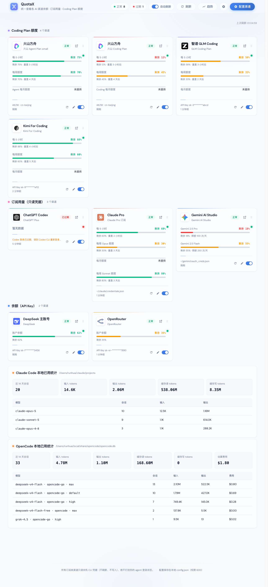
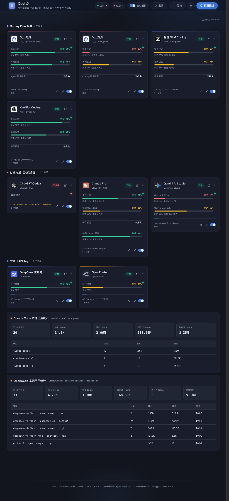
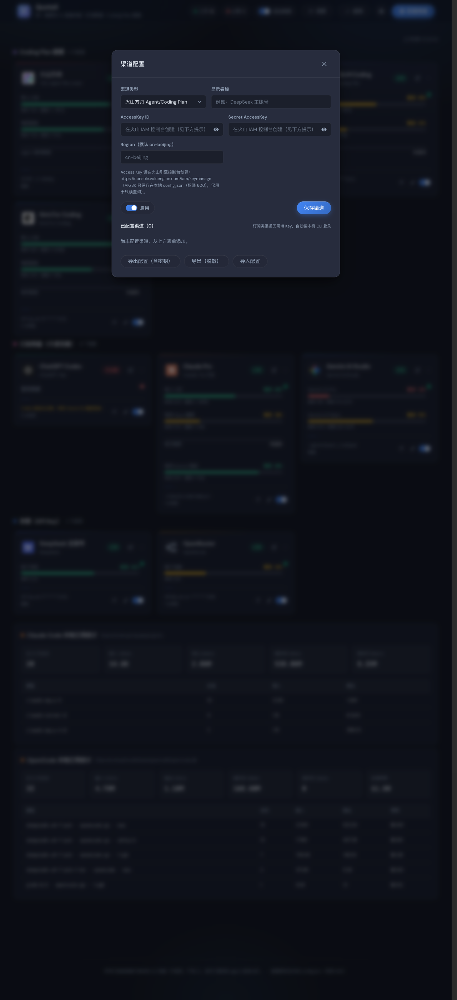
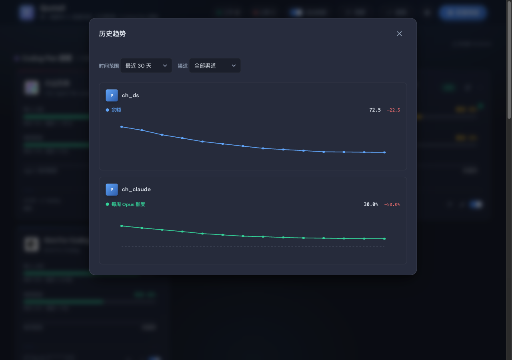
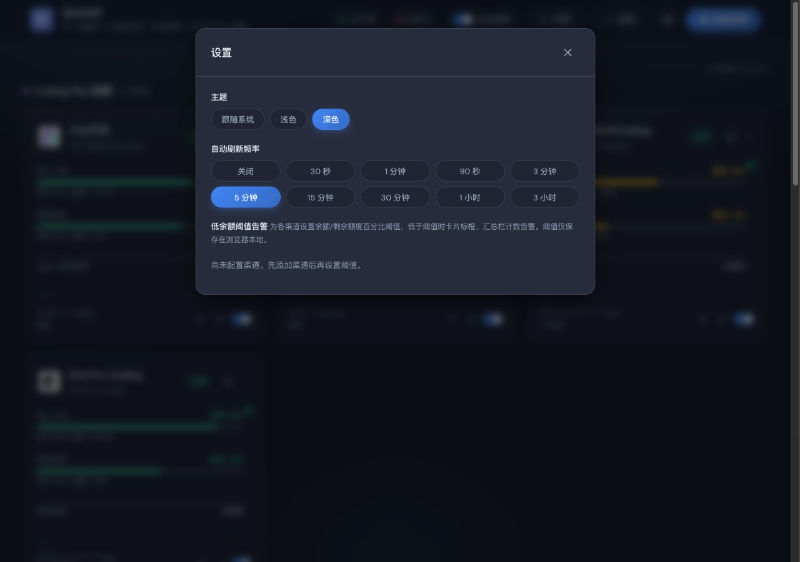

# QuotaX

> 统一查看各 AI 渠道**余额 · 订阅用量 · Coding Plan 额度**的本地 WebUI。

把散落在各家官网 / CLI / 控制台里的余额和额度数字，聚合到一个本地面板上，一眼看完。启动后浏览器打开 http://127.0.0.1:8900 。



---

## 特性

- **多渠道聚合**：余额（DeepSeek / 阶跃 / 硅基 / OpenRouter / Novita / Kimi API / 中转站）、Coding Plan（Kimi / 智谱 GLM 个人+团队 / MiniMax / 火山方舟 / ZenMux / 小米 MiMo）、订阅用量（Claude / Gemini / Grok / Codex / Copilot）、本地统计（Claude Code / OpenCode transcript）。
- **订阅渠道免填密钥**：自动读取本机 CLI 的登录凭据（Claude / Gemini / Grok / Codex / Copilot），**不刷新、不写入**，与你的 agent 共享同一份登录态。
- **按渠道 id 独立缓存 + 请求合并**：成功 60s / 失败 15s，同一渠道并发查询只打一次上游。
- **拖拽排序**：卡片可拖拽自定义顺序，顺序持久化到浏览器 `localStorage`，刷新后保留。
- **历史趋势**：每次成功查询自动记录一条趋势点，用 SVG 折线图展示余额 / 剩余百分比随时间的变化。
- **低余额告警**：为每个渠道设置剩余百分比阈值，低于阈值时卡片标橙、顶栏汇总计数。
- **深 / 浅色主题**：跟随系统或手动切换。
- **CLI 终端工具**：`quotaboard quota --brief` 单行摘要，适合 tmux statusbar / shell prompt。
- **配置导入 / 导出**：含密钥完整备份（换机迁移）或脱敏导出（安全分享渠道结构）。



## 启动

```bash
./run.sh          # 或: uv run uvicorn app.main:app --port 8900
```

测试 / 临时自测时，用环境变量 `QUOTABOARD_CONFIG` 指向一个临时文件，避免碰到项目根目录真实的 `config.json`：

```bash
QUOTABOARD_CONFIG=/tmp/quotaboard-test/config.json uv run uvicorn app.main:app --port 8931
```

## 支持的渠道

| 分类 | 渠道 | 认证方式 |
| --- | --- | --- |
| 余额 | DeepSeek / 阶跃星辰 / 硅基流动 / OpenRouter / Novita / Kimi API / new-api·one-api 中转站 | 填 API Key |
| Coding Plan | Kimi For Coding / 智谱 GLM Coding（个人+团队）/ MiniMax Token Plan / 火山方舟 Agent·Coding Plan（AK/SK）/ ZenMux / 小米 MiMo | 填 API Key / AK·SK / Cookie |
| 订阅用量 | Claude Pro·Max / Gemini AI Studio / Grok SuperGrok·X / ChatGPT Codex / GitHub Copilot | **自动读取本机 CLI 登录，无需填任何东西** |
| 本地统计 | Claude Code / OpenCode 本地已用 token（+ OpenCode 费用，如果有） | 无（读本机文件/数据库） |

new-api / one-api 中转站：优先尝试原生 `/api/user/self`；如果部署要求"系统访问令牌 + `New-API-User` 头"而不是普通业务 `sk-` key，可以在渠道配置里额外填一个可选的 `user_id`（对应 `New-API-User` 请求头），或者干脆不填，让它自动回退到 OpenAI 兼容的 `/v1/dashboard/billing/subscription` + `/v1/dashboard/billing/usage`。

火山方舟：同一账号可以**同时开通 Agent Plan 和 Coding Plan**，两个套餐会分别查询并**以左右 tab 展示**（卡片顶部「Agent Plan」/「Coding Plan」两个 tab，点哪个看哪个；每个 tab 内 5 小时 / 每周 / 每月窗口横排一行；没查到的套餐不显示对应 tab）。窗口 key 带 plan 维度（`agent_*`/`coding_*`），历史趋势图也会按套餐分线。其中一个套餐查询失败不影响另一个的展示，失败详情会附在卡片底部的 message 里。Access Key 请在火山引擎控制台创建：https://console.volcengine.com/iam/keymanage

小米 MiMo：用量查询端点（`platform.xiaomimimo.com/api/v1/tokenPlan/usage`）只接受小米账号登录后的 **Cookie**（不是 API Key）。请登录 platform.xiaomimimo.com 后，从浏览器开发者工具复制完整 Cookie 填入渠道配置的「Cookie」字段。

## 卡片排序

仪表盘卡片默认按**分类**（Coding Plan → 订阅 → 余额 → 本地）分组展示。每个分类内部，可以**拖拽卡片右下角的把手（⠿）自由排序**：

- 拖动一张卡到同分类内另一张卡的位置，两张卡交换顺序；
- 顺序持久化到浏览器 `localStorage`（`quotaboard_prefs.card_order`），刷新或重开浏览器后保留；
- 新增的渠道（localStorage 里没有记录的）会追加到该分类末尾；
- 跨分类拖拽会被拦截（卡片归属哪个分类由后端决定，前端不能改）。

## 不抢登录的设计

- 所有查询均为**只读 GET**（火山方舟走的是只读的 OpenAPI 查询 Action，同样没有任何写操作），无任何副作用；
- 订阅类渠道直接读本机 CLI 的凭据文件 / macOS Keychain（`~/.claude/.credentials.json` 或 Keychain 里的 `Claude Code-credentials`、`~/.gemini/oauth_creds.json`、`~/.grok/auth.json`、`~/.codex/auth.json`、Copilot hosts.json），**不复制、不刷新、不写入**——与 Claude Code / Gemini CLI / Grok CLI / Codex CLI 共享同一份登录态；
- 凭据过期时只提示「请到对应 CLI 重新登录」，绝不代刷 token（避免刷新令牌轮换导致 agent 登录失效）；
- 后端按渠道 id 分别缓存查询结果（成功 60s / 失败 15s，见下方「缓存」一节），避免高频打官方接口触发风控。

### Claude Code 订阅：可能只有本地统计，没有实时用量

新版 Claude Code 在 macOS 上，账号登录状态存在钥匙串条目 `Claude Code-credentials` 里，但**这个条目不一定包含明文 access token**——如果 `accessToken`/`refreshToken` 是空字符串（只有 `subscriptionType` / `rateLimitTier` / `scopes` 等元信息），说明账号确实已登录，只是本机没有存储可用的 token，查不了官方用量窗口（`api.anthropic.com/api/oauth/usage`）。

这不是"未登录"，所以本项目**不会**提示"请重新登录"——那样会误导已登录的用户。遇到这种情况，`claude_subscription` 渠道会返回 `status: "info"`，`plan_name` 形如「Claude Pro 订阅」，并在下方展示 `/api/local-usage` 里 `claude_code` 这个数据源的本地 transcript 统计（token 数，没有费用，因为 transcript 里没有费用字段，不编造）。

之前的实现有一段扫描 Keychain 里 `Claude Code-credentials-<hex>` 后缀条目的回退逻辑，用 `security dump-keychain` 全量扫描再逐个尝试——实测这些后缀条目里只有 `mcpOAuth`（MCP 服务器的 OAuth 凭据），从来不包含账号 token，纯属无效的探测路径，还可能触发钥匙串授权弹窗，已经删掉。

## 本地已用统计：`GET /api/local-usage`

多数据源本地已用统计（只读本机文件，不发网络请求），目前包含：

- `claude_code`：解析 `~/.claude/projects/*/*.jsonl` 会话 transcript（单层目录结构，即 `~/.claude/projects/<项目名>/<会话id>.jsonl`——这就是 Claude Code 实际落盘 transcript 的层级，不需要、也不会递归扫描更深的目录），按 `message.model` 聚合 token 用量（`input`/`output`/`cache_read`/`cache_write`），按 `message.id` 去重（同一条消息可能在续接/分支会话里重复出现）；没有费用字段，只报 token 数。
- `opencode`：读取 `~/.local/share/opencode/opencode.db`（SQLite），新旧两种 opencode 数据库结构都兼容；有费用字段时会显示费用（`totals.has_cost` 标记是否有真实费用数据，`cost` 恒为数值但只在 `has_cost` 为真时才代表真实花费）。

请求：`GET /api/local-usage?days=14`（`days` 取值范围 1–90，默认 14）。

响应：

```json
{
  "days": 14,
  "sources": [
    {
      "key": "claude_code",
      "label": "Claude Code 本地已用统计",
      "available": true,
      "message": null,
      "path": "/Users/xxx/.claude/projects",
      "model_stats": [
        {"model": "claude-opus-5", "sessions": 3, "messages": 44,
         "input": 100, "output": 200, "cache_read": 300, "cache_write": 400}
      ],
      "totals": {"sessions": 5, "messages": 60, "input": 100, "output": 200,
                 "cache_read": 300, "cache_write": 400, "cost": 0.0, "has_cost": false}
    },
    {"key": "opencode", "label": "OpenCode 本地已用统计", "available": true, "...": "..."}
  ]
}
```

每个 source 字段名保持一致：`key` / `label` / `available` / `message` / `path` / `model_stats` / `totals`；数据源不可用时 `available: false`、`message` 给出原因、`model_stats: []`、`totals: {}`。

`GET /api/opencode-usage?days=14` 仍然保留，作为只含 opencode 这一个数据源的向后兼容薄封装，返回扁平结构（`available`/`message`/`days`/`db_path`/`model_stats`/`totals`）。

## `GET /api/quotas`：查询与缓存

`GET /api/quotas?force=0&ids=ch_a,ch_b`

- 不带任何参数：并行查询全部渠道（停用的渠道直接返回 `status: "disabled"`，不发起网络请求），按渠道 id 分别读写缓存。
- `ids`：逗号分隔的渠道 id 列表，只查询/返回这些渠道（其它渠道的缓存条目完全不受影响，也不会被清掉）。不存在的 id 静默忽略。典型用途：卡片上的"刷新此渠道"按钮只应该刷新这一个渠道，不该把所有已配置渠道全部打一遍上游。
- `force`：跳过缓存强制重新查询。和 `ids` 正交——`?ids=ch_a&force=1` 只强刷 `ch_a`，不影响其它渠道的缓存。不带 `ids` 时 `force=1` 会强刷全部渠道。

单个渠道查询异常不会导致整个接口 500（内部用了 `asyncio.gather(..., return_exceptions=True)` 兜底成 `error` 结果）。

### `ChannelResult.status` 取值

`/api/quotas` 返回的每个渠道结果里的 `status` 字段，取值含义：

| status | 含义 | 前端建议样式 |
| --- | --- | --- |
| `ok` | 查询成功，`windows`/`amount` 是真实额度数据 | 正常/绿色 |
| `info` | 查询成功但不是"额度数据"——比如 Claude 已登录但本机没有可用 token，只能展示信息性说明（`message`）而非真实额度，`windows` 为空 | 信息/中性色，不要当成错误 |
| `expired` | 凭据/API Key 过期或失效，需要用户重新登录或更换 Key | 警告/黄色或红色 |
| `not_found` | 未登录/未找到凭据（订阅类渠道专属） | 中性/提示登录 |
| `error` | 网络错误、上游返回异常、解析失败等其它错误 | 错误/红色 |
| `disabled` | 渠道被用户停用，未发起查询 | 灰色/停用态 |

## 缓存

后端按**渠道 id** 分别缓存查询结果：成功缓存 60 秒，失败缓存 15 秒（对齐 cc-switch 的思路：错误短缓存方便快速重试，同时避免高频打官方接口触发风控）。之前的实现是整体缓存（任一渠道失败就把全局 TTL 都拖到 15s），已经改成按 id 独立缓存 + TTL。

同一渠道如果正在查询中，并发的请求会等待同一个结果，而不是重复发起（比如多个浏览器标签页同时打开时，避免各自触发一次刷新、并发打上游）。

渠道的增删改会失效对应渠道自己的缓存条目，不影响其它渠道。

## 配置

- 渠道与密钥保存在项目目录 `config.json`（原子写入，创建时即 `chmod 600`，已加入 `.gitignore`）；解析失败（文件损坏）时会把坏文件备份成 `config.json.corrupted.<时间戳>` 并报错，不会假装"没有渠道"（避免用户一保存就把损坏文件彻底覆盖，密钥全丢）。
- 订阅类渠道无需密钥，检测到本机登录即可查询，未登录会显示「未登录」（`status: "not_found"`）。
- 编辑渠道时：
  - `api_key`/`ak`/`sk` 三个密钥字段留空、或者传回 `GET` 时拿到的打码值（如 `"sk-R********1234"`），都视为"不修改密钥"，沿用旧值——绝不会被打码串覆盖；
  - 其它字段（`name`/`base_url`/`region`/`organization`/`project`/`user_id`/`enabled`）如果请求体里完全没提供该字段，也会沿用旧值，不会被清空或回退成默认值（比如前端的"启用/停用"快捷开关只发 `{"id","type","enabled"}` 这种最小 payload，不会把渠道的自定义名称、Base URL 等清掉）；如果字段**显式**传了空字符串/`null`，则视为用户想清空这个可选字段，按空值写入。
- 新建渠道时，`type` 必须是已知渠道类型，且该类型 `fields` 列表里的必填项（`api_key`/`ak`/`sk`/`base_url`）不能为空；`region`/`organization`/`project`/`user_id` 永远是可选的。校验失败返回 `400`，`detail` 是中文说明。

### 配置弹窗



配置弹窗里可以新增 / 编辑 / 删除渠道，切换渠道类型时表单字段会动态变化（比如选火山方舟会变成 AccessKey / SecretKey / Region，选订阅类则提示"无需填密钥"）。底部还有配置导入 / 导出按钮。

## 配置导入 / 导出

配置弹窗底部有三个按钮：

- **导出配置（含密钥）**：`GET /api/config/export?include_secrets=true`，导出完整 config.json（含明文密钥），适合个人备份 / 换机迁移。请妥善保管导出文件。
- **导出（脱敏）**：`GET /api/config/export?include_secrets=false`，密钥字段（`api_key`/`ak`/`sk`）整体不导出，只导出渠道结构（名称、类型、base_url 等），可安全分享给他人参考配置。导入方需要自己填密钥。
- **导入配置**：`POST /api/config/import?mode=merge|replace`，读取本地 JSON 文件。
  - `merge`（默认）：追加到现有配置，同 id 渠道覆盖；导入数据里没带的密钥会沿用现有同 id 渠道的密钥（和编辑渠道时"留空表示不修改"一致）。
  - `replace`：清空现有全部渠道后用导入的替换（危险操作，前端会二次确认）。

## 历史趋势

每次成功的额度查询（`status: "ok"`）会自动追加一条趋势记录到 `history/<channel_id>.jsonl`（与 config.json 同目录），同一天（UTC）只保留最后一条。

- `GET /api/history?days=30&ids=ch_a,ch_b`：读取历史趋势数据。`days` 取值 1–365，`ids` 可选，不传则返回全部已配置渠道。每个渠道返回一个精简后的记录数组（只含 `ts`/`status`/`amount`/`windows`，不含 message/source 等易变文本）。
- 前端顶栏「趋势」按钮打开历史趋势弹窗，用 SVG 折线图展示各渠道的余额 / 剩余百分比随时间的变化。只画已配置渠道的趋势；已删除渠道的孤儿 JSONL 不会返回。
- 趋势记录是**附加价值**：磁盘写失败绝不影响额度查询（fire-and-forget，异常静默）。



## 低余额阈值告警

设置弹窗里可以为每个渠道设置「剩余百分比阈值」。当某渠道的任一百分比窗口剩余低于该阈值时：

- 卡片会高亮成琥珀色边框（`is-low-alert` 样式）；
- 顶栏汇总徽章增加「低额度 N」计数。

阈值仅保存在浏览器 `localStorage`（`quotaboard_prefs.thresholds`），不上传后端，不参与任何网络请求。



## CLI 终端集成

项目自带命令行工具 `quotaboard`（复用与 Web 后端完全相同的查询与配置逻辑，一次性进程、无缓存、不写任何凭据副本）。用于终端 / tmux statusbar / shell prompt / 脚本：

```bash
uv run quotaboard quota                       # 文本分栏摘要（每渠道一行）
uv run quotaboard quota --brief               # 单行紧凑摘要（tmux / prompt 用）
uv run quotaboard quota --json                # 结构化 JSON（脚本 / jq 用）
uv run quotaboard quota --ids ch_a,ch_b       # 只查指定渠道
uv run quotaboard channels                    # 列出渠道（密钥打码）
uv run quotaboard cost --days 14              # 本地已用统计（只读本机文件）
uv run quotaboard config set-api-key --channel ch_a --key sk-xxx   # 脚本化更新密钥
```

`quota --brief` 输出示例（一个 ok 渠道 + 一个出错的渠道）：

```
DeepSeek 72% · Claude Pro 剩 31% · 中转站 ✗
```

`--json` 输出的 `channels` 数组结构与 `GET /api/quotas` 完全一致（含 `status`/`amount`/`windows`/`reset_at`，火山双套餐同样会拆成 `<id>_agent`/`<id>_coding` 两条），脚本可以复用同一套解析逻辑。

退出码约定：`0` 全部渠道正常（ok/info/disabled）；`1` 存在 error/expired/not_found 渠道；`2` 配置损坏或用例错误。订阅类渠道（Claude / Gemini / Grok / Codex / Copilot）在 CLI 里同样只读本机 CLI 凭据，不刷新、不写入。

## 设置（主题 / 刷新频率）

设置弹窗（顶栏齿轮图标）：

- **主题**：跟随系统 / 浅色 / 深色 三选一。手动选择会脱离系统主题，通过 `<html data-theme="...">` 强制覆盖。选择保存在 `localStorage`，刷新后保留。
- **自动刷新频率**：关闭 / 30 秒 / 1 分钟 / 90 秒（默认）/ 3 分钟 / 5 分钟。默认 90 秒略大于后端成功缓存 TTL（60 秒），确保定时刷新能拿到真正的新数据而不是一直命中缓存。

## 安全说明

- **只读承诺**：所有订阅类渠道只读本机 CLI 凭据（`security find-generic-password -w` / `read_text`），没有任何写入 / 刷新 / `security add-generic-password` 调用；凭据过期只提示重新登录，绝不代刷 token。
- **密钥存储**：`config.json` 和上传的 Codex 凭据文件均以 `0o600` 权限原子写入（临时文件创建时即带权限，不存在 world-readable 窗口，再 `os.replace` 原子替换）。
- **DNS rebinding 防护**：服务无认证、只监听 127.0.0.1，但 `GET /api/config/export?include_secrets=true` 会返回明文密钥。仅"监听本机"不是安全边界——恶意网页可用 DNS rebinding 攻击。因此中间件校验 `Host` 请求头必须在白名单（`127.0.0.1` / `localhost` / `::1`）内，Host 是浏览器自动填写、JS 无法伪造的 forbidden header，能挡住这类跨站读取。
- **路径穿越防护**：Codex 上传凭据的关联路径（`extra.codex_auth_file`）经 `resolve_codex_auth_file` 校验，必须解析到 config 同目录的 `credentials/` 子目录内、且文件名匹配 `codex_*.json`，挡住 `../../` 或绝对路径读取 / 删除任意文件。
- **XSS 防护**：所有渲染到 DOM 的用户可控文本（渠道名、base_url、message、模型名等）均经 `esc()` 转义；渲染到 `href` 的 URL 额外经 `safeUrl()` 做 scheme 白名单（仅允许 `http/https`），挡住 `javascript:` 协议注入。

## 参考实现

余额/额度查询端点移植自开源项目：
- [Proma](https://github.com/proma-ai/Proma)（DeepSeek / Kimi / MiniMax / 智谱 / Codex 查询）
- [cc-switch](https://github.com/farion1231/cc-switch)（Claude / Gemini / Grok / Copilot 订阅用量、火山方舟 SigV4、阶跃/硅基/OpenRouter/Novita 余额、opencode 本地统计）
- [xai-org/grok-build](https://github.com/xai-org/grok-build)（Grok CLI billing 端点与请求头）
- [0xtbug/Mimo-Usage](https://github.com/0xtbug/Mimo-Usage)（小米 MiMo tokenPlan/usage 端点与请求头）

## 开发

```bash
uv sync --group dev
uv run pytest                     # Python 单测
node --test tests/frontend/view-utils.test.mjs   # 前端纯函数单测（node:test）
uv run ruff check app/ tests/     # lint
```

测试全部是纯函数 / 本地文件 / 临时 SQLite 上的单测，不发起任何真实网络请求，也不会读写项目根目录的真实 `config.json`（用 `tmp_path` + `QUOTABOARD_CONFIG` / monkeypatch 隔离）。

## 技术栈

- **后端**：Python 3.13 + FastAPI + httpx，无数据库（config.json + JSONL）。
- **前端**：原生 HTML/CSS/JS（ES module），零构建步骤、零前端依赖，字体自托管。
- **CLI**：复用后端查询逻辑，argparse 入口 `quotaboard`。
