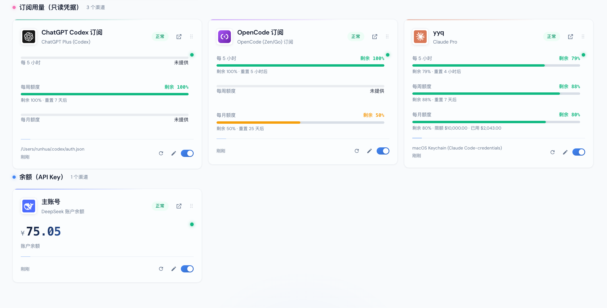
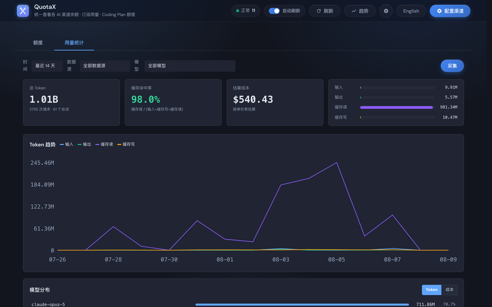

# QuotaX

> 统一查看各 AI 渠道**余额 · 订阅用量 · Coding Plan 额度**的本地 WebUI。

[English](./README.en.md) | 简体中文

把散落在各家官网 / CLI / 控制台里的余额和额度数字，聚合到一个本地面板上，一眼看完。订阅类渠道自动读取本机 CLI 登录态，无需填写任何密钥。



上方为订阅用量（Claude / Codex / OpenCode，自动读本机 CLI 登录态），下方为 API Key 余额（DeepSeek）。每个渠道一张卡，剩余百分比 + 重置倒计时一目了然。


---

## 特性

- **多渠道聚合**：余额（DeepSeek / 阶跃 / 硅基 / OpenRouter / Novita / Kimi API / 中转站）、Coding Plan（Kimi / 智谱 GLM 个人+团队 / MiniMax / 火山方舟 / ZenMux / 小米 MiMo）、订阅用量（Claude / Gemini / Grok / Codex / Copilot / OpenCode）、本地统计（Claude Code / OpenCode transcript）。
- **订阅渠道免填密钥 + 自动探测**：自动读取本机 CLI 的登录凭据（Claude / Gemini / Grok / Codex / Copilot），**不刷新、不写入**，与你的 agent 共享同一份登录态。服务启动时自动探测本机已登录的 CLI 并创建对应渠道，无需手动添加。
- **用量统计看板（深度分析）**：独立 Tab，基于 SQLite 持久化的增量采集，提供四桶 token 总览、缓存命中率、按天趋势曲线、模型分布、逐请求日志、成本估算（LiteLLM 单价表 + rebill 回填）。
- **Codex OAuth 在线授权**：ChatGPT 订阅支持在 WebUI 点一下「通过 ChatGPT 登录」完成 OAuth 授权，自动获取凭据并创建渠道。
- **按渠道 id 独立缓存 + 请求合并**：成功 60s / 失败 15s，同一渠道并发查询只打一次上游。
- **拖拽排序**：卡片可拖拽自定义顺序，顺序持久化到浏览器 `localStorage`。
- **历史趋势**：每次成功查询自动记录一条趋势点，用 SVG 折线图展示余额 / 剩余百分比随时间的变化。
- **低余额告警**：为每个渠道设置剩余百分比阈值，低于阈值时卡片标橙、顶栏汇总计数。
- **中 / 英双语**：界面支持简体中文与 English 一键切换。
- **深 / 浅色主题**：跟随系统或手动切换。
- **CLI 终端工具**：`quotaboard quota --brief` 单行摘要，适合 tmux statusbar / shell prompt。
- **配置导入 / 导出**：含密钥完整备份（换机迁移）或脱敏导出（安全分享渠道结构）。


## 一键安装

打开终端，粘贴对应你系统的命令回车即可——脚本会自动下载源码、准备 Python 运行时、安装全部依赖、启动服务，最后帮你打开浏览器。

**macOS / Linux：**

```bash
curl -fsSL https://raw.githubusercontent.com/RunhuaHuang/quotax/main/install.sh | bash
```

**Windows（PowerShell）：**

```powershell
irm https://raw.githubusercontent.com/RunhuaHuang/quotax/main/install.ps1 | iex
```

> - 首次安装会自动准备运行时：**优先复用本机已有的 Python 3.11+**；本机完全没有时才自动安装 Python 3.13。无需用户预装 Python。请耐心等待 1–2 分钟。
> - 默认安装到 `~/QuotaX`（Windows 为 `%USERPROFILE%\QuotaX`），服务监听 `127.0.0.1:8900`。
> - **安装后自动探测**：本机已登录的 Claude / Codex / Gemini / Grok / Copilot CLI 会被自动识别并创建对应渠道，无需手动添加。
> - **网络不通 / GitHub 被墙？** 脚本内置多源镜像自动 fallback（GitHub → ghfast.top → gh-proxy.com → moeyy）；也可手动指定镜像：
>   ```bash
>   QUOTAX_MIRROR=https://ghfast.top bash -c "$(curl -fsSL https://raw.githubusercontent.com/RunhuaHuang/quotax/main/install.sh)"
>   ```
>   ```powershell
>   $env:QUOTAX_MIRROR='https://ghfast.top'; irm https://raw.githubusercontent.com/RunhuaHuang/quotax/main/install.ps1 | iex
>   ```
> - **升级**：重新跑一次同样的命令即可，`config.json` / `usage.db` / `history/` 等个人数据会自动保留。

### 后续打开

首次安装完成后，以后每次打开只需在终端输入：

```
quotax
```

这会自动启动后台服务并打开浏览器（服务已在运行则直接打开浏览器）。其他命令：

| 命令 | 作用 |
| --- | --- |
| `quotax` | 启动服务并打开 WebUI（已运行则直接打开） |
| `quotax stop` | 停止后台服务 |
| `quotax status` | 查看运行状态 |
| `quotax log [N]` | 查看最近 N 行日志（默认 50，仅 macOS/Linux） |

## 支持的渠道

| 分类 | 渠道 | 认证方式 |
| --- | --- | --- |
| 余额 | DeepSeek / 阶跃星辰 / 硅基流动 / OpenRouter / Novita / Kimi API / new-api·one-api 中转站 | 填 API Key |
| Coding Plan | Kimi For Coding / 智谱 GLM Coding（个人+团队）/ MiniMax Token Plan / 火山方舟 Agent·Coding Plan（AK/SK）/ ZenMux / 小米 MiMo | 填 API Key / AK·SK / Cookie |
| 订阅用量 | Claude Pro·Max / Gemini AI Studio / Grok SuperGrok·X / ChatGPT Codex / GitHub Copilot / OpenCode Zen·Go | Claude/Gemini/Grok/Codex/Copilot **自动读取本机 CLI 登录**；OpenCode 填 **Cookie + 工作区 ID** |
| 本地统计 | Claude Code / OpenCode 本地已用 token（+ OpenCode 费用，如果有） | 无（读本机文件/数据库） |


### new-api / one-api 中转站

优先尝试原生 `/api/user/self`；如果部署要求"系统访问令牌 + `New-API-User` 头"而不是普通业务 `sk-` key，可以在渠道配置里额外填一个可选的 `user_id`（对应 `New-API-User` 请求头），或者干脆不填，让它自动回退到 OpenAI 兼容的 `/v1/dashboard/billing/subscription` + `/v1/dashboard/billing/usage`。

### 火山方舟

同一账号可以**同时开通 Agent Plan 和 Coding Plan**，两个套餐会分别查询并**以左右 tab 展示**（卡片顶部「Agent Plan」/「Coding Plan」两个 tab，点哪个看哪个；每个 tab 内 5 小时 / 每周 / 每月窗口横排一行；没查到的套餐不显示对应 tab）。窗口 key 带 plan 维度（`agent_*`/`coding_*`），历史趋势图也会按套餐分线。其中一个套餐查询失败不影响另一个的展示。Access Key 请在火山引擎控制台创建：https://console.volcengine.com/iam/keymanage

### 小米 MiMo

用量查询端点（`platform.xiaomimimo.com/api/v1/tokenPlan/usage`）只接受小米账号登录后的 **Cookie**（不是 API Key）。请登录 platform.xiaomimimo.com 后，从浏览器开发者工具复制完整 Cookie 填入渠道配置的「Cookie」字段。

### OpenCode (Zen/Go)

opencode 官网是 SSR 页面、没有公开的 JSON API，额度数据（滚动 / 周 / 月三个周期的已用百分比和重置倒计时）以内嵌的 React Server Component 序列化字符串写在 `https://opencode.ai/workspace/<工作区ID>/go` 页面的 HTML 里。需要登录态，请登录 opencode.ai 后从浏览器复制两样东西填入渠道配置：① 完整 **Cookie**；② 地址栏里的**工作区 ID**（`wrk_xxx` 格式）。Cookie 只保存在本地 config.json（权限 600），仅用于只读查询。实现参考 [Doueen/opencode-usage-extension](https://github.com/Doueen/opencode-usage-extension)。

### ChatGPT (Codex) 订阅

有三种获取凭据的方式：

1. **OAuth 在线授权**（推荐）——新建 Codex 渠道时点「通过 ChatGPT 登录」，浏览器会打开 OpenAI 授权页，用 ChatGPT 账号登录授权后自动完成 PKCE 流程换回 token、解析 account_id、自动创建渠道，全程不用手动碰任何文件，多账号只需多点几次分别授权。
2. **上传 auth.json**——如果本机已经用 Codex CLI 登录过，可以直接上传 `~/.codex/auth.json`（多账号场景每个渠道配一份）。
3. **自动读取本机 CLI 登录态**——不填任何东西，自动读 macOS Keychain 里的 `Codex Auth` 或 `~/.codex/auth.json`。

OAuth 实现参考 [CLIProxyAPI](https://github.com/router-for-me/CLIProxyAPI)（client_id / endpoints / PKCE / id_token 解析均与其一致）。

### Claude Code 订阅：可能只有本地统计，没有实时用量

新版 Claude Code 在 macOS 上，账号登录状态存在钥匙串条目 `Claude Code-credentials` 里，但**这个条目不一定包含明文 access token**——如果 `accessToken`/`refreshToken` 是空字符串（只有 `subscriptionType` / `rateLimitTier` / `scopes` 等元信息），说明账号确实已登录，只是本机没有存储可用的 token，查不了官方用量窗口（`api.anthropic.com/api/oauth/usage`）。

这不是"未登录"，所以本项目**不会**提示"请重新登录"。遇到这种情况，本项目会**自动尝试 PTY 探测**：用伪终端（PTY）启动 `claude` CLI 执行 `/usage` 命令——CLI 自己拥有 Keychain 访问权限，能在终端里显示出真实用量面板，本项目解析终端文本即可拿到「每 5 小时 / 每周」的剩余百分比（参考 [CodexBar](https://github.com/steipete/CodexBar) 的 `ClaudeStatusProbe`）。如果 PTY 探测也不可用（CLI 未安装或未登录），才降级为 `status: "info"` + 本地 transcript 统计。

> PTY 探测的前提是 Claude CLI 已在本机登录（`claude` 能正常使用）。

## 用量统计看板（深度分析）



顶栏「额度 / **用量统计**」Tab 切换。用量统计 Tab 是一个独立的深度分析看板，基于 SQLite 持久化的增量采集，提供趋势 / 模型分布 / 请求日志 / 成本估算等维度，设计参考 [Buktal/VaultOne](https://github.com/Buktal/VaultOne)。

与额度页的本地已用统计（实时全量聚合、不落库、只给当前时间窗口的汇总数字）的区别：这一套会**把解析结果落库**（`usage.db`，与 config.json 同目录），支持历史趋势、逐请求明细、增量扫描（不全量重扫）。

### 数据源

只读本机各 AI CLI 的日志文件 / 数据库，不发任何网络请求：

| 数据源 | 路径 | 格式 | 说明 |
| --- | --- | --- | --- |
| Claude Code | `~/.claude/projects/*/*.jsonl` | JSONL | `type=assistant` 行的 `message.usage`，按 `message.id` 去重 |
| Codex | `~/.codex/sessions/**/*.jsonl` + `archived_sessions/*.jsonl` | JSONL | `token_count` 事件；token 是累计值需算 delta；input 含 cache 需归一化 |
| Gemini CLI | `~/.gemini/tmp/<hash>/chats/session-*.json` | 单 JSON | `role=model` 消息；input 含 cache；output 含 thoughts |
| Grok CLI | `~/.grok/sessions/<cwd>/<uuid>/updates.jsonl` | JSONL (JSON-RPC) | `turn_completed` 事件的 `usage`；input 含 cache |
| OpenCode | `~/.local/share/opencode/opencode.db` | SQLite | 新版读 session 聚合列，老版解析 message.data JSON |

**cache-inclusive 归一化**：Codex / Gemini / Grok 的 input 字段都包含缓存命中的部分，解析时会统一减去 `cache_read` 得到"新鲜输入"，与 Claude Code 的口径对齐。

**增量采集**：JSONL 源记录每个文件的 `(mtime, line_offset)` 游标，只读游标之后的新行；遇到被并发写入的截断行时保留旧游标，下次重读。SQLite 源（opencode）记录水位线。重复采集幂等（`INSERT OR IGNORE` 按主键去重），不会产生重复记录。

### 前端看板

进入「用量统计」Tab 后首次加载，包含：

- **总览 KPI**：总 token（四桶合计）、缓存命中率（`cache_read / (input + cache_creation + cache_read)`，output 不进分母）、估算成本、请求数 / 会话数；四桶占比条。
- **Token 趋势曲线**：纯 SVG 折线图，4 条独立线（input / output / cache_read / cache_creation），按天聚合，补零保证曲线连续。
- **模型分布**：Top 8 + 其他汇总，支持 **token / 成本** 两种度量切换；点击模型名可联动筛选整个看板。
- **请求日志表**：逐请求明细（时间 / 来源 / 模型 / 四桶 token / 合计 / 成本 / 停止原因），按时间倒序，停止原因有语义着色（`end_turn` 绿 / `tool_use` 蓝 / `max_tokens` 黄 / `error` 红）。
- **筛选**：时间范围（7/14/30/90 天）、数据源、模型三维筛选，联动所有区块。

### 成本估算与单价表

成本是**按单价表估算**的，不是真实账单——单价表来源：

1. **内置价**：项目自带一份常见模型的单价（随版本更新）。
2. **LiteLLM 拉取**：点「从 LiteLLM 更新单价」从 [LiteLLM model_prices](https://raw.githubusercontent.com/BerriAI/litellm/main/model_prices_and_context_window.json) 拉取最新单价，覆盖内置价。
3. **手动编辑**：在单价表面板手动添加 / 覆盖任意模型的输入 / 输出 / 缓存读 / 缓存写单价。

所有持久化的单价只存在本地 `usage.db` 的 `model_pricing` 表，与代码内置价合并后用于成本计算。已有记录的单价变更后可点「补算 0 成本记录」对历史数据重新算费。

## 卡片排序

仪表盘卡片默认按**分类**（Coding Plan → 订阅 → 余额 → 本地）分组展示。每个分类内部，可以**拖拽卡片右下角的把手（⠿）自由排序**：

- 拖动一张卡到同分类内另一张卡的位置，两张卡交换顺序；
- 顺序持久化到浏览器 `localStorage`（`quotaboard_prefs.card_order`），刷新或重开浏览器后保留；
- 新增的渠道会追加到该分类末尾；
- 跨分类拖拽会被拦截（卡片归属哪个分类由后端决定，前端不能改）。

## 历史趋势


点顶栏「趋势」打开。每次成功的额度查询会自动记录一条趋势点（历史数据存 `history/` 子目录下的 JSONL，与 config.json 同目录）。支持按渠道、按时间范围（7/14/30/90/180 天）筛选，用 SVG 折线图展示余额或剩余百分比随时间的变化。火山渠道的 Agent / Coding 两个套餐会分线展示。

## 低余额阈值告警


在设置弹窗里为每个渠道设置「剩余百分比阈值」。低于阈值时：卡片边框标橙、状态点变红；顶栏汇总栏出现「低额度」计数。阈值只存在浏览器本地，不影响后端查询。

## 配置导入 / 导出

配置弹窗底部：

- **导出配置（含密钥）**：导出完整的 `config.json`（含明文 API Key），用于个人备份 / 换机迁移。请妥善保管。
- **导出（脱敏）**：导出不含密钥的渠道结构（类型 / 名称 / base_url 等），可安全分享给他人参考你的渠道配置。
- **导入配置**：导入时会弹窗选择**合并**（追加到现有配置，同 id 覆盖，更安全推荐）或**替换**（清空现有全部渠道后替换）。

## 不抢登录的设计

所有订阅类渠道（Claude / Gemini / Grok / Codex / Copilot）只读本机 CLI 的凭据文件 / 钥匙串，**绝不刷新 token、绝不写入任何凭据副本**——你本机的 agent 登录状态完全不受打扰，QuotaX 只是一个只读的旁观者。token 过期时只会在卡片上提示「已过期」，需要你去对应 CLI 重新登录，QuotaX 不会代你做 OAuth refresh。

## CLI 终端集成

除了 WebUI，还提供命令行工具（`quotaboard`，通过 `uv run quotaboard` 调用），适合在终端、tmux、shell prompt 或脚本里一次性查询额度：

```bash
uv run quotaboard quota                  # 查询所有渠道额度摘要（终端分栏）
uv run quotaboard quota --json           # JSON 输出（便于脚本解析）
uv run quotaboard quota --brief          # 精简模式（适合放 shell prompt）
uv run quotaboard quota --ids ch_a,ch_b  # 只查指定渠道
uv run quotaboard channels               # 列出已配置渠道（密钥打码）
uv run quotaboard cost --days 7          # 本地已用 token 统计
```

退出码：`0` 全部正常；`1` 有 error/expired 渠道；`2` 配置损坏或用法错误——适合在脚本里做健康检查。

## 缓存

为避免频繁打扰上游接口，每个渠道的查询结果在进程内有独立缓存：**成功缓存 60 秒，失败缓存 15 秒**。同一渠道在缓存有效期内的并发查询会合并成一次上游请求（请求去重 / in-flight 复用）。点顶栏「刷新」按钮可强制绕过缓存立即真查。

## 安全说明

- 服务**只监听 `127.0.0.1`**，不对外暴露。
- 所有凭据（API Key / AK·SK / Cookie）只存在本地 `config.json`（权限 `600`），不发送到任何第三方。
- 订阅渠道只读本机 CLI 凭据，不刷新不写入。
- 默认不跟随重定向（`follow_redirects: false`），防止恶意 base_url 3xx 跳转泄露 Authorization 头。
- DNS rebinding 防护：校验请求 Host 头白名单，防止恶意网页跨域读取本机接口。

## 开发

```bash
git clone https://github.com/RunhuaHuang/quotax.git
cd quotax
uv sync                      # 安装依赖（复用本机 Python 3.11+）
uv run pytest                # 跑测试（249 用例）
uv run uvicorn app.main:app --port 8900   # 启动开发服务
```

测试时用环境变量指向临时配置，避免碰到真实的 `config.json`：

```bash
QUOTABOARD_CONFIG=/tmp/quotax-test/config.json uv run uvicorn app.main:app --port 8931
```

前端是纯静态文件（无构建步骤），改完 `static/` 下的 JS/CSS 刷新即可。

## 技术栈

- **后端**：Python 3.11+ · FastAPI · httpx · 无外部数据库（config.json + SQLite + JSONL）
- **前端**：原生 ES Modules · 零构建零依赖 · 自托管字体（DM Sans + JetBrains Mono）
- **运行时管理**：uv（自动管理 Python 版本与虚拟环境）

## 参考实现

- [CodexBar](https://github.com/steipete/CodexBar) — Claude PTY 用量探测、Codex 凭据解析
- [CLIProxyAPI](https://github.com/router-for-me/CLIProxyAPI) — Codex OAuth PKCE 流程
- [Buktal/VaultOne](https://github.com/Buktal/VaultOne) — 用量统计看板设计
- [Doueen/opencode-usage-extension](https://github.com/Doueen/opencode-usage-extension) — OpenCode 额度解析
- [BerriAI/litellm](https://github.com/BerriAI/litellm) — 模型单价表数据源
